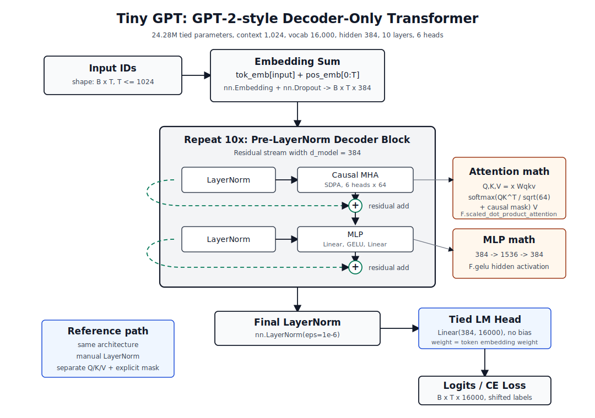

# Tiny GPT From Scratch

Tiny GPT is an educational decoder-only language model built from first
principles in PyTorch. The current model is a small story-completion model
trained on [skeskinen/TinyStories-hf](https://huggingface.co/datasets/skeskinen/TinyStories-hf).

The production model uses PyTorch scaled dot-product attention, fused QKV
projection, and native LayerNorm. A separate explicit reference model remains
available for learning, numerical comparison, and correctness tests.

- Source: <https://github.com/alainbrown/tiny-gpt>
- Model: <https://huggingface.co/alainbrown/tiny-gpt>
- Storyteller demo: <https://huggingface.co/spaces/alainbrown/tiny-gpt-demo>

## Architecture

Tiny GPT is a GPT-2-style decoder-only Transformer for next-token prediction.
It uses learned absolute positions, causal self-attention, Pre-LayerNorm
decoder blocks, GELU MLPs, and a tied language-model head. The published model
has 24,282,624 tied parameters:

| Setting | Value |
| --- | --- |
| Context length | 1,024 tokens |
| Vocabulary size | 16,000 |
| Hidden size | 384 |
| Transformer layers | 10 |
| Attention heads | 6 |
| Training dataset | `skeskinen/TinyStories-hf` |
| Training length | 3 epochs |

Latest full evaluation on 5,000 TinyStories validation examples:

| Metric | Value |
| --- | ---: |
| Validation loss | 1.4934 |
| Validation perplexity | 4.4521 |
| Evaluation tokens | 973,824 |
| Generated samples | 72 |



### Forward Pass

| Stage | Shape | Implementation | Notes |
| --- | --- | --- | --- |
| Token IDs | `(batch, sequence)` | tokenizer output | Input is already packed into next-token training blocks. |
| Token embedding | `(batch, sequence, 384)` | `nn.Embedding(16000, 384)` | Learned lookup table for byte-level BPE token IDs. |
| Position embedding | `(sequence, 384)` | `nn.Embedding(1024, 384)` | Learned absolute positions, like GPT-2. |
| Embedding dropout | `(batch, sequence, 384)` | `nn.Dropout` | Applied after token and position embeddings are added. |
| Decoder stack | `(batch, sequence, 384)` | `10 x TransformerBlock` | Each block is Pre-LayerNorm attention followed by Pre-LayerNorm MLP. |
| Final normalization | `(batch, sequence, 384)` | `nn.LayerNorm(eps=1e-6)` | Stabilizes the stream before logits. |
| LM head | `(batch, sequence, 16000)` | `nn.Linear(384, 16000, bias=False)` | Weight-tied to the token embedding in the Hugging Face wrapper. |

### Decoder Block

Each decoder block keeps the GPT-2 residual-stream pattern:

```text
x = x + dropout(causal_attention(layer_norm_1(x)))
x = x + dropout(mlp(layer_norm_2(x)))
```

The attention block projects the residual stream into query, key, and value
tensors, splits them into 6 heads of width 64, applies causal scaled dot-product
attention, recombines the heads, and projects back to width 384. The production
path uses one fused `nn.Linear(384, 3 * 384)` for QKV and calls
`torch.nn.functional.scaled_dot_product_attention(..., is_causal=True)`.

The MLP is the standard GPT-style feed-forward layer:

```text
384 -> 1536 -> GELU -> 384
```

### Implementation Paths

| Path | Role | Uses built-ins | Keeps explicit |
| --- | --- | --- | --- |
| `src/tiny_gpt/model.py` | Production training, eval, export, inference | `nn.LayerNorm`, `nn.Dropout`, `nn.Linear`, `F.gelu`, `F.scaled_dot_product_attention` | Head reshape/combine and the residual block structure. |
| `src/tiny_gpt/ref_model.py` | Mathematical reference and tests | Embeddings, linear layers, dropout | LayerNorm math, separate Q/K/V projections, causal mask construction, softmax attention. |
| `notebooks/tiny_gpt_v1.py` | Early educational build | Mostly basic PyTorch modules | First-principles GPT pieces. |
| `notebooks/tiny_gpt_v2.py` | Training-improvement notebook | Dropout and Pre-LN blocks | Educational implementation of the block internals. |
| `notebooks/tiny_gpt_v3.py` | Feature-impact notebook | Hugging Face wrapper and training experiments | Demonstrations for multi-head attention, weight decay, clipping, accumulation, mixed precision, and final LayerNorm. |

The reference model exists to show the math directly and to support numerical
equivalence tests. The production model keeps the same architecture but uses
PyTorch's optimized primitives where they are clearer, faster, and less
error-prone.

### GPT-2 Similarities and Gaps

This model follows the GPT-2 family pattern: learned token and absolute position
embeddings, causal multi-head self-attention, Pre-LayerNorm decoder blocks, GELU
MLPs, a final LayerNorm, and a tied language-model head.

It is not GPT-2 checkpoint-compatible. The current implementation does not
include KV-cached generation, padding-aware attention masks, external
`position_ids`, GPT-2's exact initialization scheme, or GPT-2 module names.

The production architecture lives in `src/tiny_gpt/model.py`. The explicit
mathematical version lives in `src/tiny_gpt/ref_model.py` and is not used by
training, evaluation, export, or inference.

## Project Direction

The reference model remains useful for:

- Mathematical comparison
- Numerical-equivalence tests
- Throughput and memory benchmarks
- Debugging causal behavior

Architectural changes such as RoPE, RMSNorm, SwiGLU, or grouped-query attention
should be evaluated separately from execution optimizations such as SDPA or
compilation.

## Results

The current published checkpoint is a TinyStories-style story completer. The
full evaluation command writes a JSON file and a Markdown report with aggregate
loss/perplexity and generated samples. Training logs charts to Aim for
loss/perplexity, optimization health, throughput, progress, checkpoints, and
sample counts.

## Repository

This is the single development repository for both Hugging Face deployments:

```text
tiny-gpt/
├── src/tiny_gpt/
│   ├── model.py               # Production SDPA and fused-QKV architecture
│   ├── ref_model.py           # Explicit educational architecture
│   ├── ref_tokenizer.py       # Explicit educational byte-level BPE
│   ├── modeling_tiny_gpt.py   # Hugging Face causal-LM wrapper
│   ├── trainer.py             # Custom training loop
│   ├── dataset.py             # Packed next-token dataset
├── apps/gradio/               # Source deployed to the Hugging Face Space
├── scripts/train_tokenizer.py # Trains the Rust-backed byte-level BPE
├── scripts/train.py           # Runs the training pipeline
├── scripts/evaluate.py        # Full storyteller eval and sample comparison
├── scripts/benchmark.py       # Throughput and memory benchmark
├── scripts/export_model.py    # Builds the Hugging Face model artifact
├── tests/                     # Reference behavior and causality tests
├── checkpoints/
│   ├── tiny_gpt/              # Local resumable training state (ignored)
│   └── tiny_gpt_hub/          # Generated model release artifact (ignored)
├── Dockerfile
├── docker-compose.yml
└── pyproject.toml
```

Deployment mapping:

```text
checkpoints/tiny_gpt_hub/  ->  HF Model: alainbrown/tiny-gpt
apps/gradio/               ->  HF Space: alainbrown/tiny-gpt-demo
```

The model repository contains weights, tokenizer files, custom Transformers
code, and the model card. The Space contains the Gradio storyteller generation
form and loads the published model from the model repository.

## Commands

Build the CUDA training image:

```bash
docker compose build training
```

Install for local development:

```bash
pip install -e .
```

Train the tokenizer and model:

```bash
docker compose --profile tools run --rm tokenizer-training
docker compose --profile training run --rm training
```

Open training charts in Aim:

```bash
docker compose --profile metrics up aim
```

Evaluate and benchmark:

```bash
python scripts/evaluate.py \
  --checkpoint checkpoints/tiny_gpt \
  --output runs/eval.json

python scripts/benchmark.py \
  --context-size 1024 \
  --vocab-size 16000 \
  --d-model 384 \
  --n-layers 10 \
  --n-heads 6 \
  --batch-sizes 8,16,32 \
  --effective-batch-size 128 \
  --warmup-steps 20 \
  --steps 100 \
  --repetitions 3 \
  --output runs/storyteller-batch-benchmark.json
```

Test, export, and run the demo:

```bash
python -m unittest discover -s tests
docker compose --profile tools run --rm hub-export
docker compose --profile gradio up gradio
```

The training checkpoint root keeps `latest/`, `best/`, retained
`steps/step_XXXXXXXX/` snapshots, progress JSON, run metadata, and a final
summary. Generated training samples are appended to
`runs/training_samples.jsonl`. Aim serves charts at <http://localhost:43800>,
and the local Gradio app serves at <http://localhost:7860>.

## Use the Model

The model includes custom Transformers code:

```python
from transformers import AutoModelForCausalLM, AutoTokenizer

model_id = "alainbrown/tiny-gpt"

tokenizer = AutoTokenizer.from_pretrained(
    model_id,
    trust_remote_code=True,
)
model = AutoModelForCausalLM.from_pretrained(
    model_id,
    trust_remote_code=True,
)

inputs = tokenizer("Once upon a time", return_tensors="pt")
logits = model(**inputs).logits
```

Review remote model code before enabling `trust_remote_code` for repositories
you do not control.

## Demo

The public demo runs at
<https://huggingface.co/spaces/alainbrown/tiny-gpt-demo>. The Space source is
under `apps/gradio`, and its pinned runtime dependencies are listed in
`apps/gradio/requirements.txt`.

## Limitations

This is a small educational model trained on synthetic children's stories.
It is best understood as a TinyStories-style text completer, not a general
chatbot. It is not instruction-tuned or intended for production, factual
question answering, or safety-critical applications. Its 1,024-token context and
small parameter count limit plot continuity and prompt adherence. Generated
text may be repetitive, incoherent, incorrect, or inappropriate.

## License

MIT
